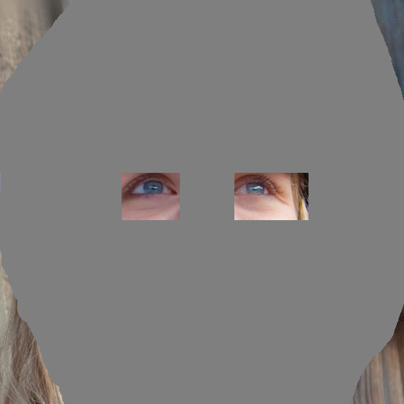
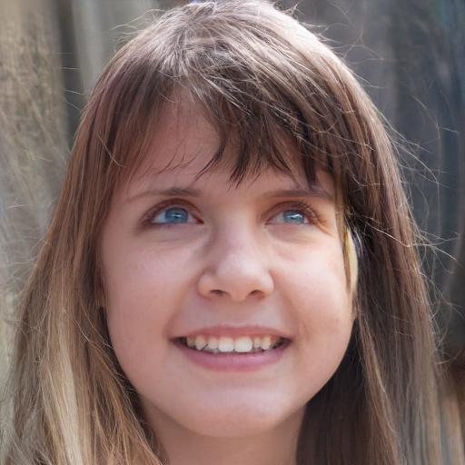

# co-mod-gan-pytorch
Implementation of the paper ``Large Scale Image Completion via Co-Modulated Generative Adversarial Networks"

official tensorflow version: https://github.com/zsyzzsoft/co-mod-gan

Input image Mask  Result  

## Usage

### requirments
```
conda install pytorch==1.7.1 torchvision==0.8.2 cudatoolkit=10.2 -c pytorch
conda install pillow
```

### inference 

1. download pretrained model using ``download/*.sh" (converted from the tensorflow pretrained model)

e.g. ffhq512

```
./download/ffhq512.sh
```

converted model:
* FFHQ 512 checkpoints/co-mod-gan-ffhq-9-025000.pth
* FFHQ 1024 checkpoints/co-mod-gan-ffhq-10-025000.pth
* Places 512 checkpoints/co-mod-gan-places2-050000.pth

2. use the following command as a minimal example of usage

```
python test.py -i imgs/ffhq_in.png -m imgs/ffhq_m.png -o ./imgs/example_output.jpg -c checkpoints/co-mod-gan-ffhq-9-025000.pth
```

### Demo
Coming soon

### Training
Coming soon

## Reference

[1] official tensorflow version: https://github.com/zsyzzsoft/co-mod-gan

[2] stylegan2-pytorch https://github.com/rosinality/stylegan2-pytorch
